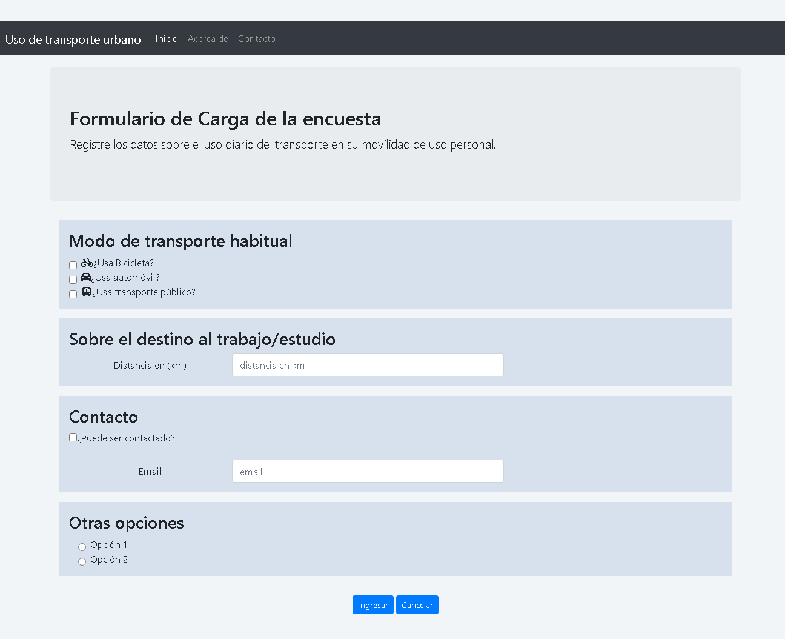

# Actividad en el aula  - Encuestas

Temas:
   - clases y objetos, 
   - arreglos, ordenamiento
   - windows form, 
   - ventanas modales
   - separación vista del modelo (biblioteca de clases, otras implementaciones de la vista)
     

###  Vista Web

Implementación web

        
        
Figura 1. 

  

